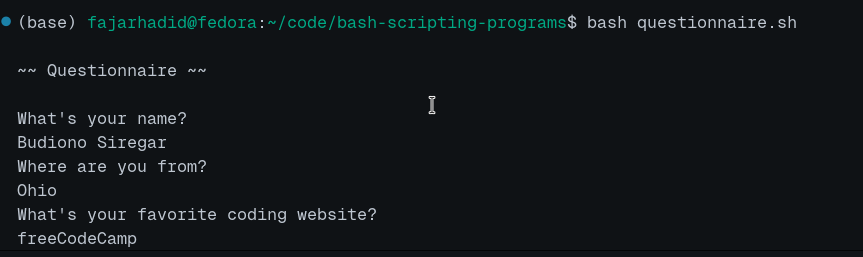
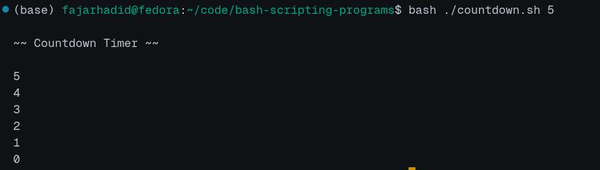
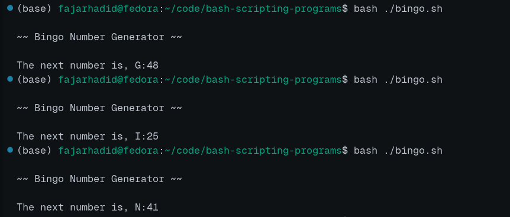
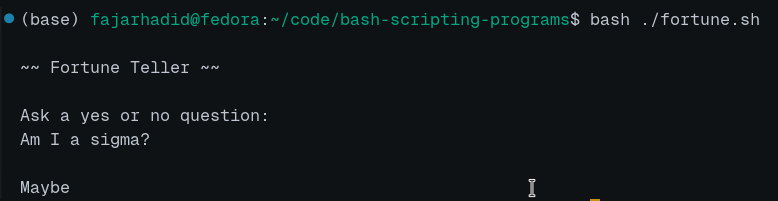

# bash-scripting-programs

This repository consists of 5 bash scripting programs based on references from existing lessons at freeCodeCamp with the title of Learn Bash Scripting by Building Five Programs.

## Questionnaire
This program consists of questions and answers from the input given by the user. There are 3 questions: 
1. `What's your name?`
2. `Where are you from?`
3. `What's your favorite coding website?`

## Countdown
This program will count down according to the arguments given by the user. Here is an example of count down that start from 5:

## Bingo
This program randomly give you bingo numbers that range from 1 to 75.

## Fortune Teller
This program will tell your fortune based on what questions you ask. You will randomly get something between 6 answers:
1. Yes
2. No
3. Maybe
4. Outlook good
5. Don't count on it
6. Ask again later

## Five
This program just act as an executor for all the four programs before.